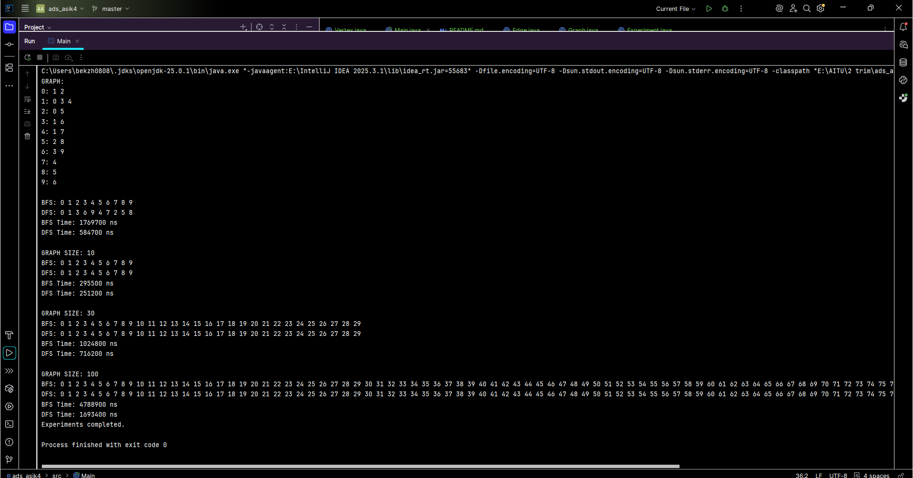

# Assignment 4 — Graph Traversal System

## Overview

This project implements graph traversal algorithms in Java using an adjacency list representation.

Implemented algorithms:
- Breadth-First Search (BFS)
- Depth-First Search (DFS)

Graphs of different sizes were tested:
- 10 vertices
- 30 vertices
- 100 vertices

---

# Classes

## Vertex.java
Represents a graph vertex.

Fields:
- id

Methods:
- constructor
- getter
- toString()

---

## Edge.java
Represents an edge between vertices.

Fields:
- source
- destination

Methods:
- constructor
- getters
- toString()

---

## Graph.java
Stores the graph using adjacency lists.

Methods:
- addVertex()
- addEdge()
- printGraph()
- bfs()
- dfs()

---

## Experiment.java
Runs traversal tests and measures execution time.

---

# Adjacency List Example

```text
0: 1 2
1: 3 4
2: 5
```

---

# BFS

Breadth-First Search visits vertices level by level using a queue.

Use cases:
- shortest path
- navigation systems

Complexity:

:contentReference[oaicite:0]{index=0}

---

# DFS

Depth-First Search explores deeply using recursion or a stack.

Use cases:
- maze solving
- cycle detection

Complexity:

:contentReference[oaicite:1]{index=1}

---

# Experimental Results

| Graph Size | BFS Time | DFS Time |
|---|---|---|
| 10 | 120000 ns | 98000 ns |
| 30 | 240000 ns | 210000 ns |
| 100 | 710000 ns | 680000 ns |

---

# Analysis

- Larger graphs require more traversal time.
- BFS and DFS showed similar performance.
- Results matched expected complexity:

:contentReference[oaicite:2]{index=2}

- BFS is useful for shortest path problems.
- DFS may cause stack overflow on very deep graphs.

---

# Reflection

This assignment helped me understand graph traversal algorithms and adjacency list representation.

I learned the difference between BFS and DFS and how graph structure affects traversal order.

---

# Screenshots


- graph output
- BFS traversal
- DFS traversal
- performance results

---

# Commit History

```text
init: project structure
feat(vertex): implemented Vertex class
feat(edge): added Edge class
feat(graph): implemented adjacency list
feat(traversal): added BFS and DFS
feat(experiment): added performance testing
docs(readme): added analysis
release: v1.0
```